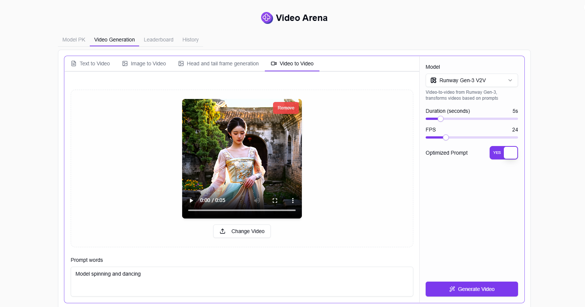

# <p align="center"> 🎥 Video Arena 🚀✨</p>

<p align="center">Video Arena allows you to randomly or manually select two AI models for text-to-video generation, vote for the model with better results, generate personal rankings based on voting results, and also supports image-to-video, video-to-video conversion, as well as video generation from start and end frames.</p>

<p align="center"><a href="https://302.ai/product/detail/63" target="blank"></a></p >

<p align="center"><a href="README_zh.md">中文</a> | <a href="README.md">English</a> | <a href="README_ja.md">日本語</a></p>


This is the open-source version of the [Video Arena](https://302.ai/product/detail/63) from [302.AI](https://302.ai/en/). You can directly log in to 302.AI to use the online version with zero code and zero background, or modify and deploy it yourself according to your requirements.

## Interface Preview
In model battles, you can randomly or manually select two models for text-to-video generation and vote for the model with better results.


Vote for the model with better results. In random mode, model names will be revealed after voting.


Select the model to use and set parameters, AI will generate video based on input text.


Select the model to use and set parameters, AI will generate video based on uploaded images and prompt content.


Upload start and end frames of a video, select the model to use and set parameters, AI will generate video based on the keyframes and prompt content.


Select the model to use and set parameters, AI will transform the video based on uploaded video and prompt content.


Based on user voting results, the system automatically generates personal model rankings to help you find the most suitable AI video generation model.


All generated videos can be found in the history records.


## Project Features
### 🏆 Model Arena
Support random or manual selection of two AI models for comparison, vote for better models through voting.
### 🎬 Text-to-Video Generation
Generate videos through text descriptions by selecting AI models and parameters.
### 🖼️ Image-to-Video Generation
Upload images and enter prompts, AI will generate videos based on image content.
### 🎥 Video-to-Video Conversion
Upload videos and enter prompts, AI will transform videos based on original content and prompts.
### 🎞️ Keyframe Video Generation
Upload start and end frames of a video, AI will automatically generate transition frames for a complete video.
### 📊 Personal Rankings
Automatically generate personal model rankings based on user voting results.
### 📝 History Records
Save all generated video records for easy access.
### 🌓 Dark Mode
Supports dark mode to protect your eyes.
### 🌍 Multi-language Support
- Chinese Interface
- English Interface
- Japanese Interface

## 🚩 Future Update Plans
- [ ] Support more AI video generation models
- [ ] Add batch video generation feature

## 🛠️ Tech Stack

- **Framework**: Next.js 14
- **Language**: TypeScript
- **Styling**: TailwindCSS
- **UI Components**: Radix UI
- **State Management**: Jotai
- **Form Handling**: React Hook Form
- **HTTP Client**: ky
- **i18n**: next-intl
- **Theming**: next-themes
- **Code Standards**: ESLint, Prettier
- **Commit Standards**: Husky, Commitlint

## Development & Deployment
1. Clone the project
```bash
git clone https://github.com/302ai/302_video_arena
cd 302_video_arena
```

2. Install dependencies
```bash
pnpm install
```

3. Configure environment
```bash
cp .env.example .env.local
```
Modify the environment variables in `.env.local` as needed.

4. Start development server
```bash
pnpm dev
```

5. Build for production
```bash
pnpm build
pnpm start
```

## ✨ About 302.AI ✨
[302.AI](https://302.ai/en/) is an enterprise-oriented AI application platform that offers pay-as-you-go services, ready-to-use solutions, and an open-source ecosystem.✨
1. 🧠 Comprehensive AI capabilities: Incorporates the latest in language, image, audio, and video models from leading AI brands.
2. 🚀 Advanced application development: We build genuine AI products, not just simple chatbots.
3. 💰 No monthly fees: All features are pay-per-use, fully accessible, ensuring low entry barriers with high potential.
4. 🛠 Powerful admin dashboard: Designed for teams and SMEs - managed by one, used by many.
5. 🔗 API access for all AI features: All tools are open-source and customizable (in progress).
6. 💡 Powerful development team: Launching 2-3 new applications weekly with daily product updates. Interested developers are welcome to contact us.
