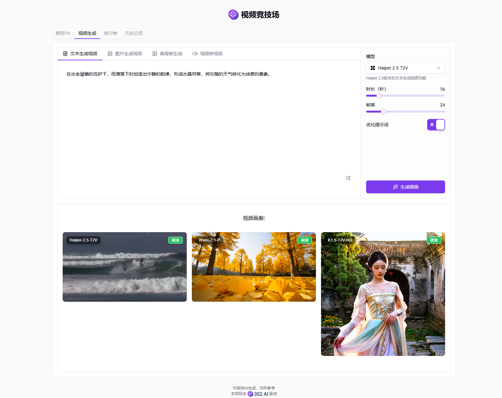
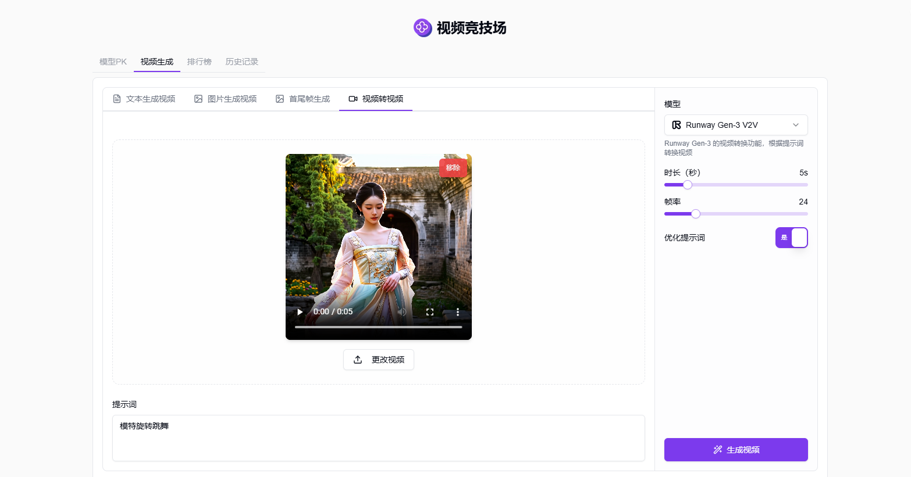
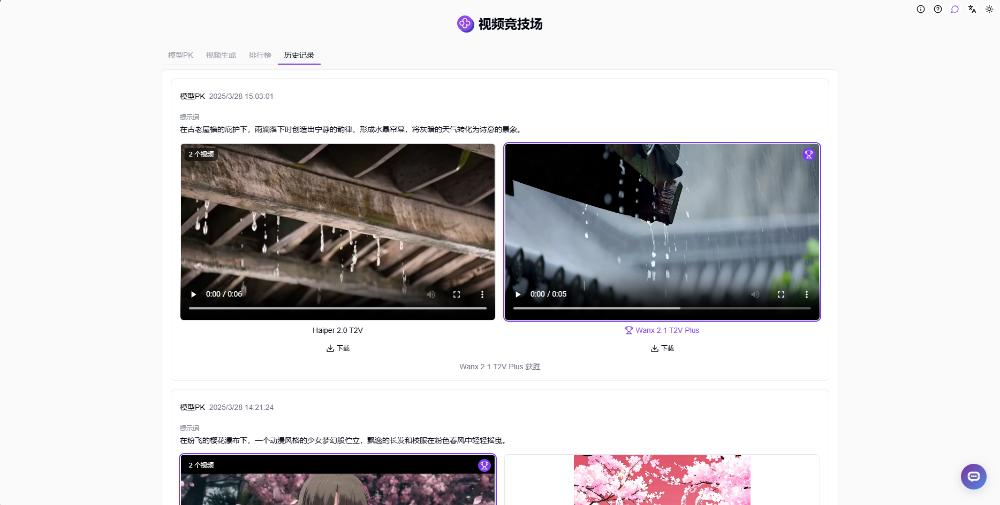

# <p align="center"> 🎥 動画リスト 🚀✨</p>

<p align="center">ビデオアリーナでは、ランダムまたは選択した2つのAIモデルでテキストから動画を生成し、より良い効果のモデルに投票して、投票結果に基づいて個人ランキングを生成します。また、画像から動画生成、動画変換、開始/終了フレームを選択して動画生成することもできます。</p>

<p align="center"><a href="https://302.ai/ja/tools/videoarena/" target="blank"></a></p >

<p align="center"><a href="README_zh.md">中文</a> | <a href="README.md">English</a> | <a href="README_ja.md">日本語</a></p>


[302.AI](https://302.ai/ja/)の[動画リスト](https://302.ai/ja/tools/videoarena/)のオープンソース版です。
302.AIに直接ログインすることで、コード不要、設定不要のオンライン体験が可能です。
あるいは、このプロジェクトをニーズに合わせてカスタマイズし、302.AIのAPI KEYを統合して、自身でデプロイすることもできます。

## インターフェースプレビュー
モデル対決では、ランダムまたは選択した2つのモデルでテキストから動画を生成し、より良い効果のモデルに投票できます。
<video src="https://github.com/user-attachments/assets/687dcaf5-c2b8-4e0e-9e83-9f15ad65fe0e" controls></video>

より良い効果のモデルに投票し、ランダムモードではモデル名が投票後に表示されます。


使用するモデルを選択してパラメータを設定すると、AIが入力されたテキストから動画を生成します。


使用するモデルを選択してパラメータを設定すると、AIがアップロードされた画像とプロンプトから動画を生成します。


画像から動画を生成した効果です。
<video src="https://github.com/user-attachments/assets/f44327b1-7e48-4bb0-a91e-81ebba9ce36b" controls></video>

動画の開始画像と終了画像をアップロードし、使用するモデルとパラメータを選択すると、AIが最初と最後のフレーム画像とプロンプトから動画を生成します。


使用するモデルを選択してパラメータを設定すると、AIがアップロードされた動画とプロンプトから動画を変換します。


ユーザーの投票結果に基づいて、システムは自動的に個人モデルランキングを生成し、最適なAI動画生成モデルを見つけるのを支援します。


生成された画像はすべて履歴で確認できます。


## プロジェクトの特徴
### 🏆 モデルアリーナ
ランダムまたは選択した2つのAIモデルで対決し、投票でより優れたモデルを選出します。
### 🎬 テキストから動画生成
テキスト説明を入力し、AIモデルとパラメータを選択するだけで動画を生成できます。
### 🖼️ 画像から動画生成
画像をアップロードしてプロンプトを入力すると、AIが画像の内容から動画を生成します。
### 🎥 動画変換
動画をアップロードしてプロンプトを入力すると、AIが元の動画とプロンプトに基づいて動画を変換します。
### 🎞️ 開始/終了フレームから動画生成
動画の開始と終了画像をアップロードすると、AIが自動的に中間フレームを生成して完全な動画を作成します。
### 📊 個人ランキング
ユーザーの投票結果に基づいて、自動的に個人モデルランキングを生成します。
### 📝 履歴記録
生成されたすべての動画記録を保存し、簡単に確認できます。
### 🌓 ダークモード
ダークモードをサポートしており、あなたの目を保護します。
### 🌍 多言語サポート
- 中国語インターフェース
- 英語インターフェース
- 日本語インターフェース

## 🚩 将来のアップデート計画
- [ ] より多くのAI動画生成モデルのサポート
- [ ] バッチ動画生成機能の追加

## 🛠️ 技術スタック

- **フレームワーク**: Next.js 14
- **言語**: TypeScript
- **スタイリング**: TailwindCSS
- **UIコンポーネント**: Radix UI
- **状態管理**: Jotai
- **フォーム処理**: React Hook Form
- **HTTPクライアント**: ky
- **国際化**: next-intl
- **テーマ**: next-themes
- **コード規約**: ESLint, Prettier
- **コミット規約**: Husky, Commitlint

## 開発&デプロイ
1. プロジェクトのクローン
```bash
git clone https://github.com/302ai/302_video_arena
cd 302_video_arena
```

2. 依存関係のインストール
```bash
pnpm install
```

3. 環境設定
```bash
cp .env.example .env.local
```
必要に応じて`.env.local`の環境変数を修正してください。

4. 開発サーバーの起動
```bash
pnpm dev
```

5. プロダクションビルド
```bash
pnpm build
pnpm start
```

## ✨ 302.AIについて ✨
[302.AI](https://302.ai/ja/)は企業向けのAIアプリケーションプラットフォームであり、必要に応じて支払い、すぐに使用できるオープンソースのエコシステムです。✨
1. 🧠 包括的なAI機能：主要AIブランドの最新の言語、画像、音声、ビデオモデルを統合。
2. 🚀 高度なアプリケーション開発：単なるシンプルなチャットボットではなく、本格的なAI製品を構築。
3. 💰 月額料金なし：すべての機能が従量制で、完全にアクセス可能。低い参入障壁と高い可能性を確保。
4. 🛠 強力な管理ダッシュボード：チームやSME向けに設計 - 一人で管理し、多くの人が使用可能。
5. 🔗 すべてのAI機能へのAPIアクセス：すべてのツールはオープンソースでカスタマイズ可能（進行中）。
6. 💪 強力な開発チーム：大規模で高度なスキルを持つ開発者集団。毎週2-3の新しいアプリケーションをリリースし、毎日製品更新を行っています。才能ある開発者の参加を歓迎します。
