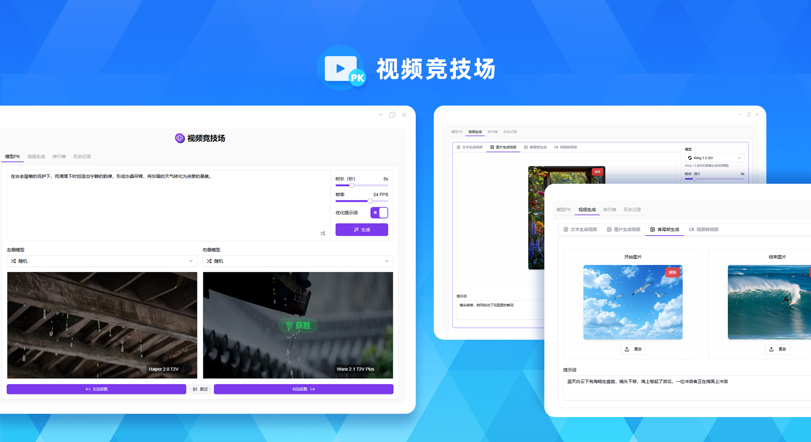
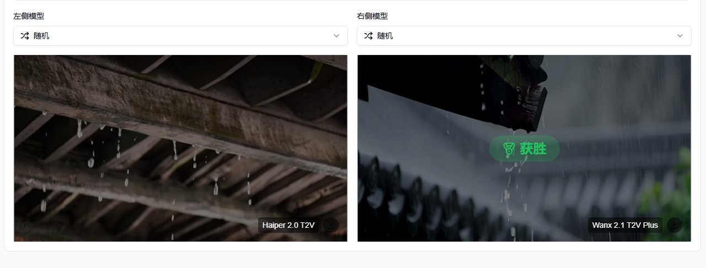
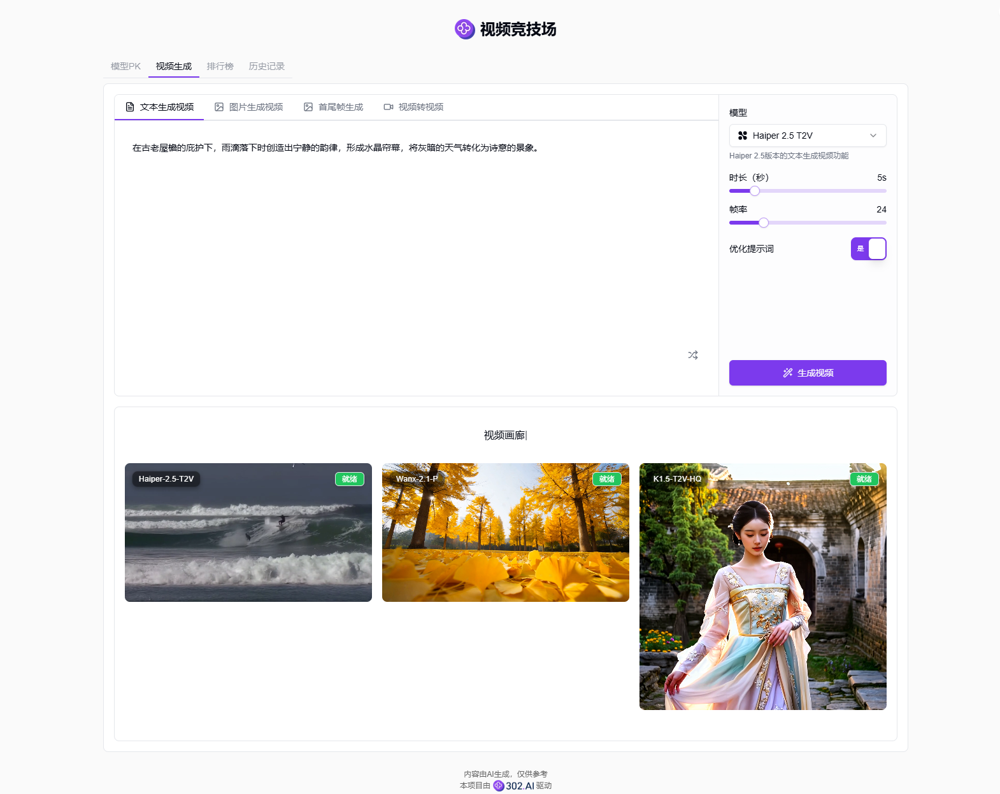
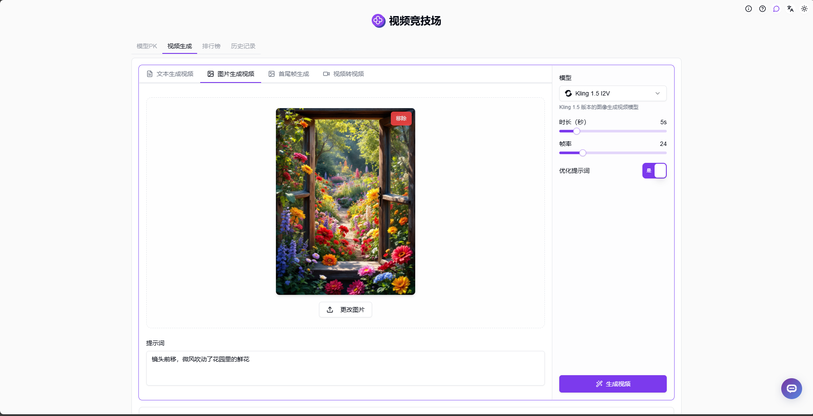
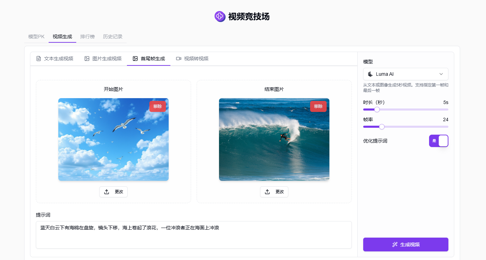
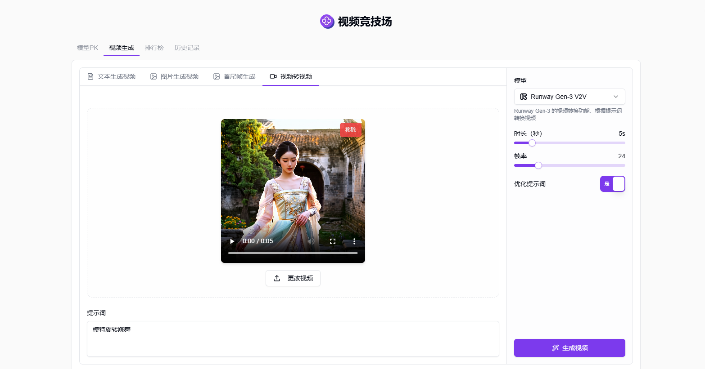
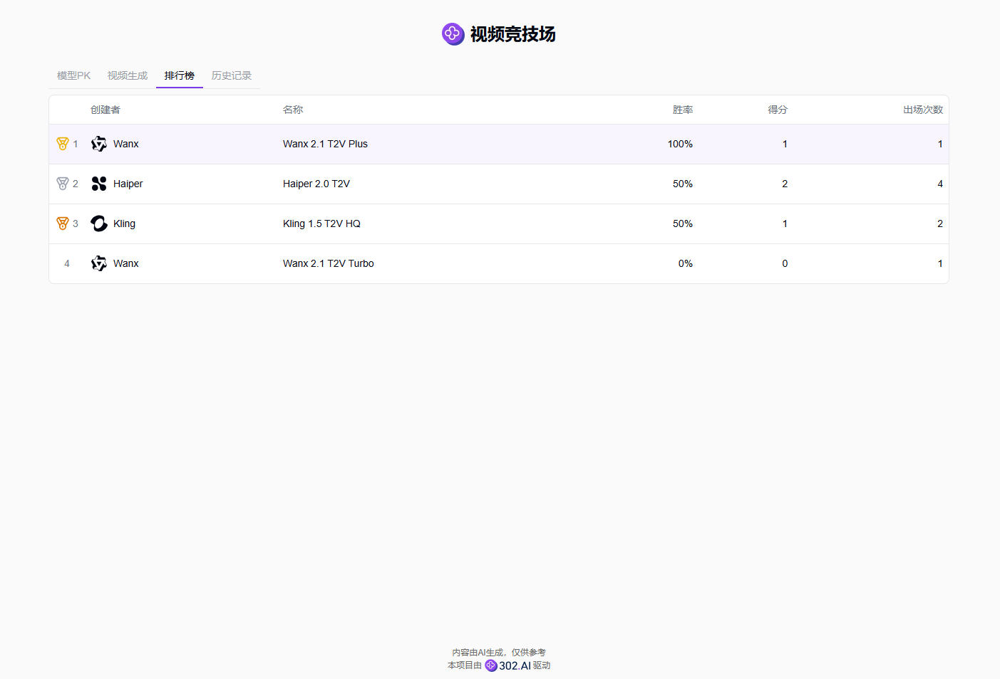
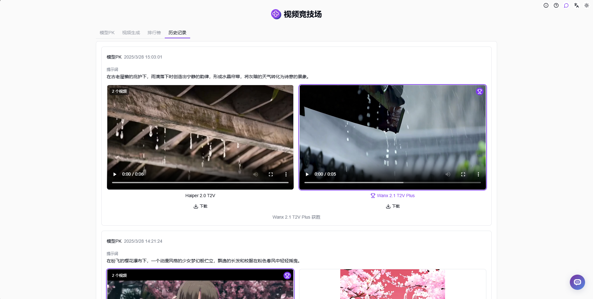

# <p align="center"> 🎥 视频竞技场 🚀✨</p>

<p align="center">视频竞技场随机或自选两个AI模型进行文生视频，投票选择效果更佳的模型，根据投票结果生成个人排行榜，还可以进行图生视频、视频转视频以及选择首尾帧生成视频。</p>

<p align="center"><a href="https://302.ai/tools/videoarena/" target="blank"></a></p >

<p align="center"><a href="README_zh.md">中文</a> | <a href="README.md">English</a> | <a href="README_ja.md">日本語</a></p>



来自[302.AI](https://302.ai)的[视频竞技场](https://302.ai/tools/videoarena/)的开源版本。你可以直接登录302.AI，零代码零配置使用在线版本。或者对本项目根据自己的需求进行修改，传入302.AI的API KEY，自行部署。

## 界面预览
在模型PK中可以随机或自选两个模型进行文生视频，并投票选出效果更佳的模型。
<video src="https://github.com/user-attachments/assets/851b0abc-9513-4efd-afb4-2ef3a9afd029" controls></video>

投票选择效果更佳的模型，随机模式下的模型名将在投票后展示。


选择使用的模型并设置参数，AI将根据输入的文本生成视频。


选择使用的模型并设置参数，AI将根据上传的图片和提示词内容生成视频。


图片生成视频的生成效果。
<video src="https://github.com/user-attachments/assets/f44327b1-7e48-4bb0-a91e-81ebba9ce36b" controls></video>

上传视频的开始图片和结束图片，选择使用的模型并设置参数，AI将根据首尾帧图片和提示词内容生成视频。


选择使用的模型并设置参数，AI将根据上传的视频和提示词内容转换视频。


根据用户的投票结果，系统会自动生成个人模型排行榜，帮助你找到最适合的AI生成视频模型。


生成过的图片都可以在历史记录中找到。



## 项目特性
### 🏆 模型竞技场
支持随机或自选两个AI模型进行PK，通过投票选出更优秀的模型。
### 🎬 文本生成视频
通过文字描述，选择AI模型和参数，即可生成视频。
### 🖼️ 图片生成视频
上传图片并输入提示词，AI将根据图片内容生成视频。
### 🎥 视频转视频
上传视频并输入提示词，AI将根据原视频和提示词进行视频转换。
### 🎞️ 首尾帧生成视频
上传视频的开始和结束图片，AI将自动生成中间过渡帧生成完整视频。
### 📊 个人排行榜
根据用户投票结果，自动生成个人模型排行榜。
### 📝 历史记录
保存所有生成过的视频记录，方便查看。
### 🌓 暗色模式
支持暗色模式，保护您的眼睛。
### 🌍 多语言支持
  - 中文界面
  - English Interface
  - 日本語インターフェース

## 🚩 未来更新计划
- [ ] 支持更多AI视频生成模型
- [ ] 添加批量视频生成功能

## 🛠️ 技术栈

- **框架**: Next.js 14
- **语言**: TypeScript
- **样式**: TailwindCSS
- **UI组件**: Radix UI
- **状态管理**: Jotai
- **表单处理**: React Hook Form
- **HTTP客户端**: ky
- **国际化**: next-intl
- **主题**: next-themes
- **代码规范**: ESLint, Prettier
- **提交规范**: Husky, Commitlint

## 开发&部署
1. 克隆项目
```bash
git clone https://github.com/302ai/302_video_arena
cd 302_video_arena
```

2. 安装依赖
```bash
pnpm install
```

3. 环境配置
```bash
cp .env.example .env.local
```
根据需要修改 `.env.local` 中的环境变量。

4. 启动开发服务器
```bash
pnpm dev
```

5. 构建生产版本
```bash
pnpm build
pnpm start
```

## ✨ 302.AI介绍 ✨
[302.AI](https://302.ai)是一个按需付费的AI应用平台，为用户解决AI用于实践的最后一公里问题。
1. 🧠 集合了最新最全的AI能力和品牌，包括但不限于语言模型、图像模型、声音模型、视频模型。
2. 🚀 在基础模型上进行深度应用开发，我们开发真正的AI产品，而不是简单的对话机器人
3. 💰 零月费，所有功能按需付费，全面开放，做到真正的门槛低，上限高。
4. 🛠 功能强大的管理后台，面向团队和中小企业，一人管理，多人使用。
5. 🔗 所有AI能力均提供API接入，所有工具开源可自行定制（进行中）。
6. 💡 强大的开发团队，每周推出2-3个新应用，产品每日更新。有兴趣加入的开发者也欢迎联系我们
